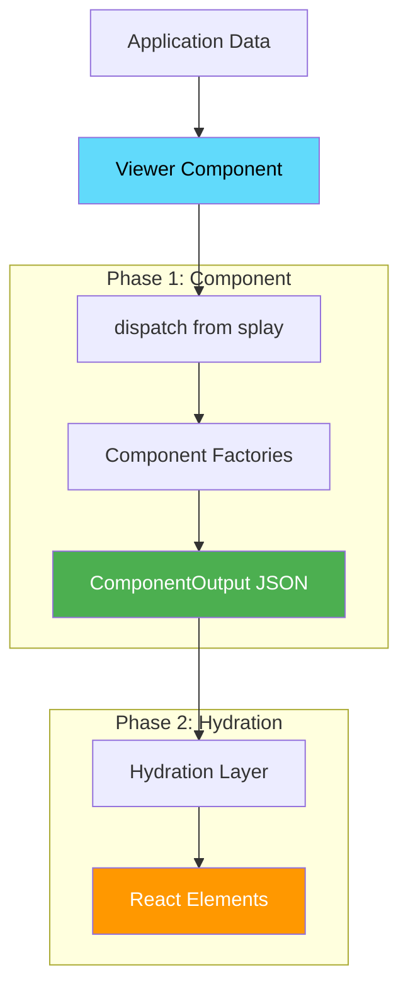
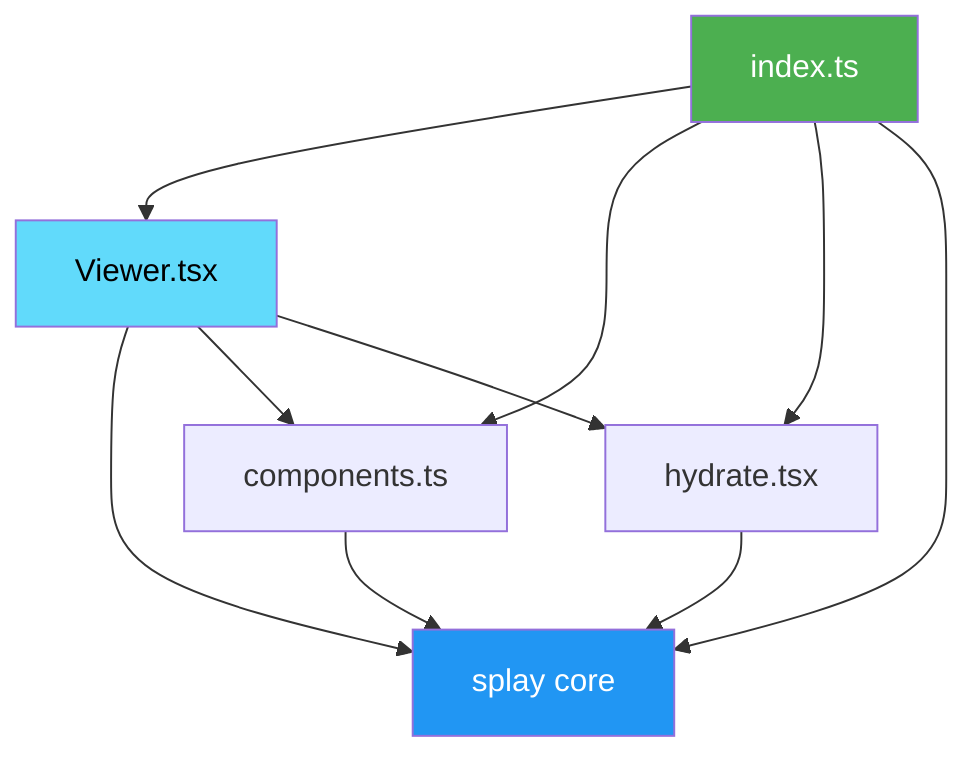
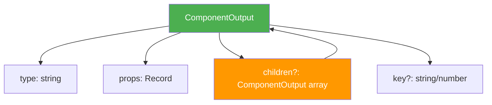
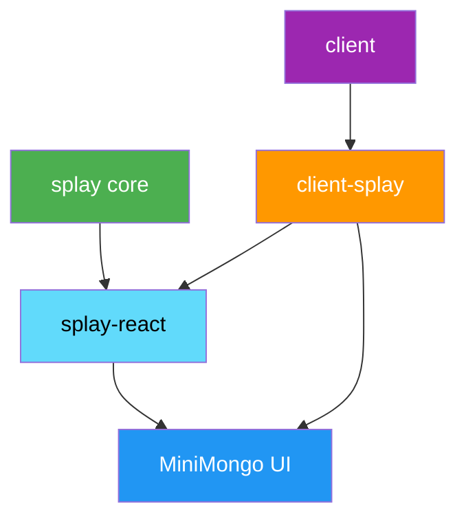

# Splay React

[](https://www.typescriptlang.org/)
[](https://reactjs.org/)
[](https://opensource.org/licenses/ISC)

**React adapter for [splay](https://github.com/mark1russell7/splay)** - Recursive data rendering for React.

**Complete two-phase architecture**: Render to serializable `ComponentOutput`, then hydrate to React elements.

## Table of Contents

- [Overview](#overview)
- [Architecture](#architecture)
- [Installation](#installation)
- [Quick Start](#quick-start)
- [Core Concepts](#core-concepts)
- [API Reference](#api-reference)
- [Advanced Usage](#advanced-usage)
- [Integration with Ecosystem](#integration-with-ecosystem)
- [Examples](#examples)
- [Dependencies](#dependencies)
- [License](#license)

## Overview

Splay React is a thin wrapper around the framework-agnostic [splay](https://github.com/mark1russell7/splay) core that brings type-driven recursive rendering to React. It uses a **two-phase rendering architecture**:

1. **Component Phase**: Render data to serializable `ComponentOutput` objects
2. **Hydration Phase**: Convert `ComponentOutput` to React elements

This separation enables:
- **Server-Side Rendering**: Render on server, send JSON, hydrate on client
- **Remote Procedures**: Call rendering procedures via RPC
- **Testing**: Test component logic without React
- **Flexibility**: Custom hydration strategies per component type

### Key Features

- **Two-Phase Rendering**: Component output → React hydration
- **Zero Configuration**: Works out-of-box with default primitive viewers
- **Type-Driven**: Automatic type inference with `TYPE_SYMBOL` support
- **Recursive**: Automatic nested data rendering
- **Customizable**: Extend viewers and hydration components
- **Layout Utilities**: Built-in grid, list, and split layouts
- **SSR-Ready**: Serializable component output

## Architecture

### Overall System Architecture



### Data Flow Diagram

```
┌─────────────────────────────────────────────────────────────────────────────┐
│                              REACT APP                                       │
│                                                                              │
│   <Viewer data={user} size={{ width: 400, height: 300 }} />                │
│                                                                              │
└───────────────────────────────────────┬─────────────────────────────────────┘
                                        │
                                        ▼
┌─────────────────────────────────────────────────────────────────────────────┐
│                          VIEWER COMPONENT                                    │
│                                                                              │
│  1. Get/create ComponentRegistry (with primitive components)                │
│  2. dispatch(data, size, path, { registry }) → ComponentOutput              │
│  3. hydrate(ComponentOutput) → ReactNode                                    │
│  4. Return <>{ReactNode}</>                                                 │
│                                                                              │
└───────────────────────────────────────┬─────────────────────────────────────┘
                                        │
                    ┌───────────────────┴───────────────────┐
                    │                                       │
                    ▼                                       ▼
┌─────────────────────────────────────┐  ┌─────────────────────────────────────┐
│      COMPONENT PHASE                │  │      HYDRATION PHASE                │
│                                     │  │                                     │
│  Component Factories:               │  │  Hydration Components:              │
│  ┌────────────────────────────────┐ │  │  ┌────────────────────────────────┐ │
│  │ stringComponent(ctx) → {       │ │  │  │ StringHydration({ output }) {  │ │
│  │   type: "string",              │ │  │  │   return <span>{output.props  │ │
│  │   props: { value: "..." }      │ │  │  │     .value}</span>            │ │
│  │ }                              │ │  │  │ }                              │ │
│  └────────────────────────────────┘ │  │  └────────────────────────────────┘ │
│                                     │  │                                     │
│  ┌────────────────────────────────┐ │  │  ┌────────────────────────────────┐ │
│  │ arrayComponent(ctx) → {        │ │  │  │ ArrayHydration({ output,      │ │
│  │   type: "array",               │ │  │  │   children }) {                │ │
│  │   props: { layout: [...] },    │ │  │  │   return <div>               │ │
│  │   children: [...]              │ │  │  │     {children.map(c => ...)} │ │
│  │ }                              │ │  │  │   </div>                      │ │
│  └────────────────────────────────┘ │  │  └────────────────────────────────┘ │
│                                     │  │                                     │
│  Output: ComponentOutput (JSON)     │  │  Output: ReactNode                  │
└─────────────────────────────────────┘  └─────────────────────────────────────┘
```

### Module Hierarchy



### Component Output Structure



## Installation

```bash
npm install github:mark1russell7/splay-react#main
```

Or with pnpm:

```bash
pnpm add github:mark1russell7/splay-react#main
```

This automatically installs `@mark1russell7/splay` as a dependency.

### Peer Dependencies

- `react` (>=18)

## Quick Start

```tsx
import { Viewer } from "@mark1russell7/splay-react";

function App() {
  const data = {
    name: "Alice",
    age: 30,
    tags: ["developer", "designer"],
    active: true
  };

  return (
    <Viewer
      data={data}
      size={{ width: 400, height: 300 }}
    />
  );
}
```

That's it! The `Viewer` component automatically:
1. Creates a default registry with primitive viewers
2. Dispatches to `ComponentOutput`
3. Hydrates to React elements
4. Handles recursive rendering

## Core Concepts

### 1. Two-Phase Rendering

Splay React separates rendering into two phases:

**Phase 1: Component Phase**
- Render data to serializable `ComponentOutput` objects
- Pure data transformation (no React)
- Can be executed server-side or in procedures

**Phase 2: Hydration Phase**
- Convert `ComponentOutput` to React elements
- Maps component types to React components
- Executes in browser/React environment

```tsx
import { render, hydrate } from "@mark1russell7/splay-react";

// Phase 1: Render to ComponentOutput (can be server-side)
const output = render(
  { name: "Alice", age: 30 },
  { width: 400, height: 300 },
  "$"
);

// Serialize and send over network
const json = JSON.stringify(output);

// Phase 2: Hydrate to React (client-side)
const element = hydrate(JSON.parse(json));

// Render
root.render(<>{element}</>);
```

### 2. Viewer Component

The main React component that combines both phases:

```tsx
import { Viewer } from "@mark1russell7/splay-react";

<Viewer
  data={myData}                  // Any data
  size={{ width: 400, height: 300 }}  // Available space
  path="$"                       // Optional: path prefix
  registry={customRegistry}      // Optional: custom component registry
  hydrationMap={customMap}       // Optional: custom hydration map
/>
```

**Props:**
- `data` (required): Any data to render
- `size` (required): Container dimensions
- `path` (optional): Path prefix (default: "$")
- `registry` (optional): Custom component registry (default: primitives)
- `hydrationMap` (optional): Custom hydration components

### 3. Component Factories

Component factories transform data into serializable `ComponentOutput`:

```tsx
import { type RenderContext, type ComponentOutput } from "@mark1russell7/splay-react";

// Simple component factory
export const stringComponent = (ctx: RenderContext): ComponentOutput => ({
  type: "string",
  props: { value: String(ctx.data) },
});

// Recursive component factory
export const arrayComponent = (ctx: RenderContext): ComponentOutput => {
  const data = ctx.data as unknown[];
  const layout = gridLayout(ctx.size, data.length, 2, 40);

  return {
    type: "array",
    props: { layout },
    children: layout.map(({ size, index }) =>
      ctx.render(data[index], size, `${ctx.path}[${index}]`) as ComponentOutput
    ),
  };
};
```

**Built-in Component Factories:**
- `nullComponent` - Renders null
- `undefinedComponent` - Renders undefined
- `stringComponent` - Renders strings
- `numberComponent` - Renders numbers
- `booleanComponent` - Renders booleans
- `dateComponent` - Renders dates (ISO string)
- `arrayComponent` - Renders arrays with grid layout
- `objectComponent` - Renders objects with list layout

### 4. Hydration Components

Hydration components convert `ComponentOutput` to React elements:

```tsx
import type { HydrationProps, ReactNode } from "@mark1russell7/splay-react";

// Simple hydration component
export const StringHydration = ({ output }: HydrationProps): ReactNode => (
  <span style={{ color: "#a31515" }}>
    &quot;{String(output.props["value"])}&quot;
  </span>
);

// Recursive hydration component
export const ArrayHydration = ({ output, children }: HydrationProps): ReactNode => {
  const layout = output.props["layout"] as LayoutItem[];

  return (
    <div style={{ position: "relative" }}>
      {layout.map(({ pos, size, index }) => (
        <div
          key={index}
          style={{
            position: "absolute",
            left: pos.x,
            top: pos.y,
            width: size.width,
            height: size.height,
          }}
        >
          {children?.[index]}
        </div>
      ))}
    </div>
  );
};
```

**Built-in Hydration Components:**
- `NullHydration` - Renders "null" in gray italic
- `UndefinedHydration` - Renders "undefined" in gray italic
- `StringHydration` - Renders quoted strings in red
- `NumberHydration` - Renders numbers in green
- `BooleanHydration` - Renders booleans in blue
- `DateHydration` - Renders ISO date strings in green
- `ArrayHydration` - Renders array with absolute positioning
- `ObjectHydration` - Renders object as key-value pairs
- `KeyValueHydration` - Renders individual key-value pair

### 5. Custom Types

Use `TYPE_SYMBOL` to tag data with custom types:

```tsx
import { TYPE_SYMBOL, createDefaultRegistry, Viewer } from "@mark1russell7/splay-react";
import type { RenderContext, ComponentOutput, HydrationProps } from "@mark1russell7/splay-react";

// Create registry
const registry = createDefaultRegistry();

// Register component factory
registry.register("user", (ctx: RenderContext): ComponentOutput => {
  const user = ctx.data as { name: string; email: string; avatar: string };
  return {
    type: "user",
    props: { name: user.name, email: user.email, avatar: user.avatar },
  };
});

// Create custom hydration map
import { extendHydrationMap } from "@mark1russell7/splay-react";

const UserHydration = ({ output }: HydrationProps) => (
  <div className="user-card">
    
    <h3>{output.props["name"]}</h3>
    <p>{output.props["email"]}</p>
  </div>
);

const customMap = extendHydrationMap({
  user: UserHydration,
});

// Tag data
const user = {
  [TYPE_SYMBOL]: "user",
  name: "Alice",
  email: "alice@example.com",
  avatar: "/avatars/alice.png",
};

// Render
<Viewer
  data={user}
  size={{ width: 300, height: 200 }}
  registry={registry}
  hydrationMap={customMap}
/>
```

### 6. Recursive Rendering

Component factories use `ctx.render()` for nested data:

```tsx
import { createDefaultRegistry, type RenderContext, type ComponentOutput } from "@mark1russell7/splay-react";

const registry = createDefaultRegistry();

registry.register("user-list", (ctx: RenderContext): ComponentOutput => {
  const users = ctx.data as Array<{ name: string }>;

  return {
    type: "user-list",
    props: { count: users.length },
    children: users.map((user, i) =>
      ctx.render(
        { ...user, [TYPE_SYMBOL]: "user" },
        { width: ctx.size.width, height: 60 },
        `${ctx.path}[${i}]`
      ) as ComponentOutput
    ),
  };
});
```

## API Reference

### Components

#### `<Viewer>`

Main recursive renderer component.

```tsx
interface ViewerProps {
  data: unknown;                     // Data to render
  size: Size;                        // Container dimensions
  path?: string;                     // Path prefix (default: "$")
  registry?: ComponentRegistry;      // Component registry
  hydrationMap?: HydrationMap;       // Hydration components
}

export const Viewer: NamedExoticComponent<ViewerProps>;
```

**Example:**
```tsx
<Viewer
  data={{ name: "Alice", age: 30 }}
  size={{ width: 400, height: 300 }}
  path="$"
  registry={customRegistry}
  hydrationMap={customMap}
/>
```

### Functions

#### `render()`

Renders data to `ComponentOutput` without hydration (for SSR/procedures).

```tsx
function render(
  data: unknown,
  size: Size,
  path?: string,
  registry?: ComponentRegistry
): ComponentOutput | undefined;
```

**Example:**
```tsx
import { render } from "@mark1russell7/splay-react";

const output = render(
  { name: "Alice" },
  { width: 400, height: 300 },
  "$"
);

// Send output over network as JSON
const json = JSON.stringify(output);
```

#### `createDefaultRegistry()`

Creates a registry with primitive component factories.

```tsx
function createDefaultRegistry(): ComponentRegistry;
```

**Example:**
```tsx
import { createDefaultRegistry } from "@mark1russell7/splay-react";

const registry = createDefaultRegistry();
// Already has: null, undefined, string, number, boolean, date, array, object
```

#### `registerComponents()`

Registers all primitive components to a registry.

```tsx
function registerComponents(registry: ComponentRegistry): void;
```

**Example:**
```tsx
import { createRegistry, registerComponents } from "@mark1russell7/splay-react";

const registry = createRegistry<ComponentOutput>();
registerComponents(registry);
```

#### `hydrate()`

Converts `ComponentOutput` to React elements using default hydration map.

```tsx
function hydrate(output: ComponentOutput): ReactNode;
```

**Example:**
```tsx
import { hydrate } from "@mark1russell7/splay-react";

const element = hydrate(componentOutput);
root.render(<>{element}</>);
```

#### `createHydrate()`

Creates a custom hydrate function with custom hydration map.

```tsx
function createHydrate(
  components: HydrationMap,
  fallback?: HydrationComponent
): (output: ComponentOutput) => ReactNode;
```

**Example:**
```tsx
import { createHydrate, extendHydrationMap } from "@mark1russell7/splay-react";

const customMap = extendHydrationMap({
  user: UserHydration,
  product: ProductHydration,
});

const customHydrate = createHydrate(customMap);
const element = customHydrate(output);
```

#### `extendHydrationMap()`

Extends default hydration map with custom components.

```tsx
function extendHydrationMap(custom: HydrationMap): HydrationMap;
```

**Example:**
```tsx
import { extendHydrationMap } from "@mark1russell7/splay-react";

const map = extendHydrationMap({
  user: UserHydration,
  product: ProductHydration,
});
// Has all defaults + custom components
```

### Types

```typescript
// Viewer props
export interface ViewerProps {
  data: unknown;
  size: Size;
  path?: string;
  registry?: ComponentRegistry;
  hydrationMap?: HydrationMap;
}

// Component registry (outputs ComponentOutput)
export type ComponentRegistry = Registry<ComponentOutput>;

// React registry (legacy - outputs ReactNode)
export type ReactRegistry = Registry<ReactNode>;

// Hydration props passed to hydration components
export interface HydrationProps {
  output: ComponentOutput;
  children?: ReactNode[];
}

// Hydration component type
export type HydrationComponent = ComponentType<HydrationProps>;

// Map of component types to hydration components
export type HydrationMap = Record<string, HydrationComponent>;
```

### Component Factories

All component factories exported from `components.ts`:

```typescript
export function nullComponent(ctx: RenderContext): ComponentOutput;
export function undefinedComponent(ctx: RenderContext): ComponentOutput;
export function stringComponent(ctx: RenderContext): ComponentOutput;
export function numberComponent(ctx: RenderContext): ComponentOutput;
export function booleanComponent(ctx: RenderContext): ComponentOutput;
export function dateComponent(ctx: RenderContext): ComponentOutput;
export function arrayComponent(ctx: RenderContext): ComponentOutput;
export function objectComponent(ctx: RenderContext): ComponentOutput;

export function registerComponents(registry: Registry<ComponentOutput>): void;
export const primitiveComponents: Record<string, (ctx: RenderContext) => ComponentOutput>;
```

### Hydration Components

All hydration components exported from `hydrate.tsx`:

```typescript
export const NullHydration: HydrationComponent;
export const UndefinedHydration: HydrationComponent;
export const StringHydration: HydrationComponent;
export const NumberHydration: HydrationComponent;
export const BooleanHydration: HydrationComponent;
export const DateHydration: HydrationComponent;
export const ArrayHydration: HydrationComponent;
export const ObjectHydration: HydrationComponent;
export const KeyValueHydration: HydrationComponent;

export const defaultHydrationMap: HydrationMap;
```

### Re-exports from Splay

```typescript
// Core functions
export { createRegistry, dispatch, resolve, isDynamic, inferType } from "@mark1russell7/splay";

// Layout utilities
export { gridLayout, listLayout, splitLayout } from "@mark1russell7/splay";

// Path utilities
export { arrayPath, objectPath, pathDepth } from "@mark1russell7/splay";

// Symbol
export { TYPE_SYMBOL } from "@mark1russell7/splay";

// Types
export type {
  RenderContext,
  Size,
  Position,
  ComponentOutput,
  ComponentFactory,
  ResolveContext,
  DynamicValue,
  DispatchConfig,
  Registry,
  LayoutItem,
} from "@mark1russell7/splay";
```

## Advanced Usage

### Custom Component with Layout

```tsx
import { gridLayout, createDefaultRegistry } from "@mark1russell7/splay-react";
import type { RenderContext, ComponentOutput } from "@mark1russell7/splay-react";

const registry = createDefaultRegistry();

registry.register("product-grid", (ctx: RenderContext): ComponentOutput => {
  const products = ctx.data as Array<{ id: string; name: string }>;
  const layout = gridLayout(ctx.size, products.length, 3, 100);

  return {
    type: "product-grid",
    props: { layout },
    children: layout.map(({ size, index }) =>
      ctx.render(
        { ...products[index], [TYPE_SYMBOL]: "product" },
        size,
        `${ctx.path}[${index}]`
      ) as ComponentOutput
    ),
  };
});
```

### Server-Side Rendering

```tsx
// server.ts
import { render } from "@mark1russell7/splay-react";

app.get("/api/render", (req, res) => {
  const data = { name: "Alice", age: 30 };
  const output = render(data, { width: 400, height: 300 });
  res.json(output);
});

// client.tsx
import { hydrate } from "@mark1russell7/splay-react";

const response = await fetch("/api/render");
const output = await response.json();
const element = hydrate(output);
root.render(<>{element}</>);
```

### Remote Procedure Calls

```tsx
// With @mark1russell7/client
import { useApiClient } from "@mark1russell7/client";
import { hydrate, type ComponentOutput } from "@mark1russell7/splay-react";

function RemoteViewer({ dataId }: { dataId: string }) {
  const client = useApiClient();
  const [output, setOutput] = useState<ComponentOutput | null>(null);

  useEffect(() => {
    client.call(["splay", "render"], {
      dataId,
      size: { width: 400, height: 300 },
    }).then(setOutput);
  }, [dataId]);

  if (!output) return <div>Loading...</div>;
  return <>{hydrate(output)}</>;
}
```

### Custom Hydration with Styles

```tsx
import { extendHydrationMap } from "@mark1russell7/splay-react";
import type { HydrationProps } from "@mark1russell7/splay-react";

const ProductHydration = ({ output }: HydrationProps) => (
  <div className="product-card">
    
    <h3>{output.props["name"]}</h3>
    <p className="price">${output.props["price"]}</p>
  </div>
);

const customMap = extendHydrationMap({
  product: ProductHydration,
});

<Viewer
  data={productData}
  size={{ width: 400, height: 300 }}
  hydrationMap={customMap}
/>
```

## Integration with Ecosystem

Splay React integrates with the mark1russell7 ecosystem:



- **splay** - Framework-agnostic core
- **splay-react** - React adapter (this package)
- **client** - Universal RPC client
- **client-splay** - Remote rendering procedures
- **MiniMongo** - Application using splay for data visualization

## Examples

### Example 1: Basic Usage

```tsx
import { Viewer } from "@mark1russell7/splay-react";

function App() {
  const data = {
    users: [
      { name: "Alice", age: 30 },
      { name: "Bob", age: 25 }
    ]
  };

  return <Viewer data={data} size={{ width: 600, height: 400 }} />;
}
```

### Example 2: Custom Type

```tsx
import { TYPE_SYMBOL, createDefaultRegistry, Viewer, extendHydrationMap } from "@mark1russell7/splay-react";
import type { RenderContext, ComponentOutput, HydrationProps } from "@mark1russell7/splay-react";

// Component factory
const registry = createDefaultRegistry();
registry.register("badge", (ctx: RenderContext): ComponentOutput => ({
  type: "badge",
  props: { label: ctx.data as string },
}));

// Hydration component
const BadgeHydration = ({ output }: HydrationProps) => (
  <span className="badge">{output.props["label"]}</span>
);

const hydrationMap = extendHydrationMap({ badge: BadgeHydration });

// Tagged data
const badge = {
  [TYPE_SYMBOL]: "badge",
  label: "New",
};

<Viewer
  data={badge}
  size={{ width: 100, height: 30 }}
  registry={registry}
  hydrationMap={hydrationMap}
/>
```

### Example 3: Nested Data

```tsx
import { Viewer } from "@mark1russell7/splay-react";

const data = {
  company: "Acme Inc",
  departments: [
    {
      name: "Engineering",
      employees: [
        { name: "Alice", role: "Developer" },
        { name: "Bob", role: "Designer" }
      ]
    },
    {
      name: "Sales",
      employees: [
        { name: "Charlie", role: "Manager" }
      ]
    }
  ]
};

<Viewer data={data} size={{ width: 800, height: 600 }} />
```

## Dependencies

### Production

- `@mark1russell7/splay` (github:mark1russell7/splay#main) - Core rendering engine

### Peer Dependencies

- `react` (>=18) - React library

### Development

- `typescript` (^5.9.3) - TypeScript compiler
- `@types/react` (^19.0.0) - React type definitions
- `@mark1russell7/cue` - Build configuration tool
- `vite` (^6.0.0) - Build tool

## Package Structure

```
splay-react/
├── src/
│   ├── index.ts          # Public API exports
│   ├── Viewer.tsx        # Main Viewer component + render()
│   ├── components.ts     # Component factories (ComponentOutput)
│   ├── hydrate.tsx       # Hydration layer (ComponentOutput → React)
│   └── legacy exports    # Backwards compatibility
├── dist/                 # Compiled output
├── package.json
└── tsconfig.json
```

## License

ISC

---

**Repository**: [github.com/mark1russell7/splay-react](https://github.com/mark1russell7/splay-react)
**Issues**: [github.com/mark1russell7/splay-react/issues](https://github.com/mark1russell7/splay-react/issues)
**Related**: [splay core](https://github.com/mark1russell7/splay)
